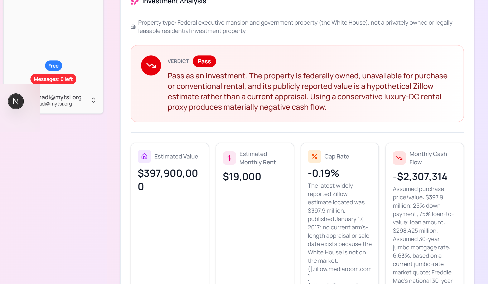
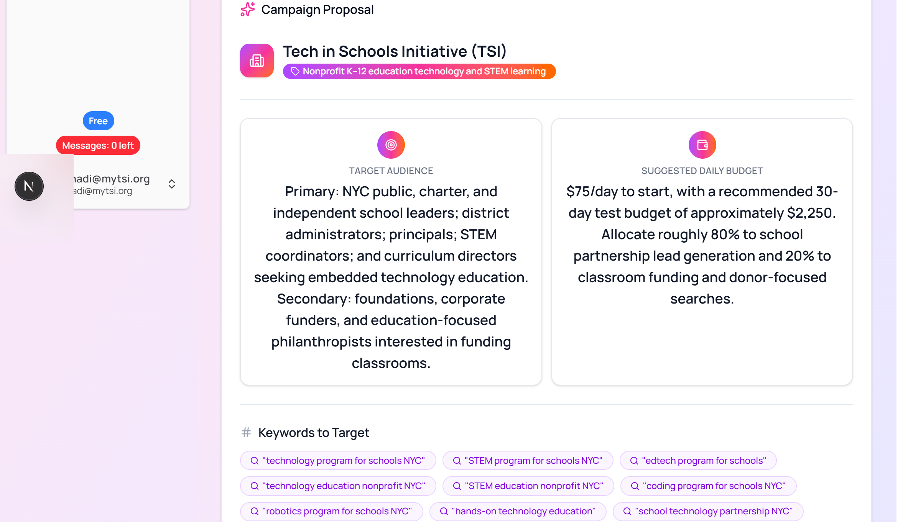
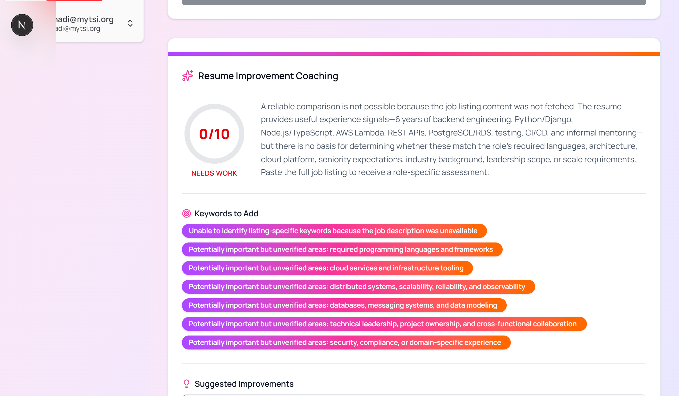

# AI Tutor API SAAS Starter


Use workflows created with [AI Tutor API](https://aitutor-api.vercel.app/).  
This template is based on [Vercel SAAS Starter](https://github.com/nextjs/saas-starter).

## Overview

The **AI Tutor API SAAS Starter** is your complete starting point to build SaaS applications that integrate AI workflows powered by AI Tutor API. This template leverages the powerful foundation of Vercel SAAS Starter and extends it with Stripe-based subscription management, PostgreSQL (using Drizzle ORM), Resend-powered transactional email, and per‑month message tracking with limits based on subscription tiers.

## Tech Stack

- **Framework:** Next.js 16 (App Router), in a pnpm/Turborepo monorepo
- **Database:** PostgreSQL, powered by [Drizzle ORM](https://orm.drizzle.team/)
- **Payments:** Stripe (integrated with Stripe CLI for local testing)
- **AI Service:** [AI Tutor API](https://aitutor-api.vercel.app/) workflow integration
- **Authentication:** JWT-based authentication stored in cookies, with Resend + React Email powered password reset
- **UI Components:** shadcn/ui and custom components
- **Deployment:** Vercel

## Project Structure

This is a pnpm workspace / Turborepo monorepo:

- **`apps/web`** – the Next.js application (routes, API handlers, dashboard UI).
- **`packages/db`** – Drizzle schema, client, queries, subscription tiers, and DB scripts (`@repo/db`).
- **`packages/ui`** – shared shadcn-derived UI components (`@repo/ui`).
- **`packages/email`** – Resend client and React Email templates for transactional email (`@repo/email`).
- **`packages/config`** – shared TypeScript and ESLint configuration (`@repo/config`).

## Getting Started

### Installation

1. **Clone the Repository:**

   ```bash
   git clone https://github.com/your-username/ai-tutor-api-saas-starter.git
   cd ai-tutor-api-saas-starter
   ```

2. **Install Dependencies:**

   ```bash
   pnpm install
   ```

3. **Environment Setup:**

   - Copy the example environment file and rename it to `.env`, inside `apps/web/` (this is a pnpm workspace — the Next.js app lives at `apps/web/`, and that's where it resolves `.env` from, not the repo root):

     ```bash
     cp apps/web/.env.example apps/web/.env
     ```

   - Update the following keys in your `apps/web/.env` file:
     - `POSTGRES_URL` – Your database URL.
     - `STRIPE_SECRET_KEY` – Your Stripe secret key.
     - `STRIPE_WEBHOOK_SECRET` – Your Stripe webhook secret.
     - `BASE_URL` – Your application’s base URL (e.g., `http://localhost:3000`).
     - `AUTH_SECRET` – A secret key for JWT signing (e.g. generated with `openssl rand -base64 32`).
     - `RESEND_API_KEY` – Your [Resend](https://resend.com/) API key, used to send password-reset emails.
     - `RESEND_FROM_EMAIL` – The verified "from" address Resend sends password-reset emails from.
     - `AITUTOR_API_KEY` – Your API key for AI Tutor API.
     - `WORKFLOW_ID` – The workflow ID used by the original "Custom Workflow" page.
     - `WORKFLOW_ID_REAL_ESTATE_ANALYSIS` – The workflow ID used by the Real Estate Investment Analysis example page.
     - `WORKFLOW_ID_GOOGLE_ADS_ANALYSIS` – The workflow ID used by the Google Ads Campaign Analysis example page.
     - `WORKFLOW_ID_RESUME_SCREENING` – The workflow ID used by the Resume & Candidate Fit Analysis example page.

4. **Run the Development Server:**

   ```bash
   pnpm dev
   ```

   The app will then be accessible at [http://localhost:3000](http://localhost:3000).

5. **Migrate and seed the database:**

   ```bash
   pnpm run db:generate
   pnpm run db:migrate
   pnpm run db:seed
   ```

   The seed script creates a default sign-in you can use immediately in local development:
   - **Email:** `test@test.com`
   - **Password:** `admin123`

## Deploying to Production (Vercel + Neon)

This is the exact path used to stand this app up on Vercel with a fresh Neon Postgres database:

1. **Create the Vercel project** and link it to the app, not the repo root:

   ```bash
   npx vercel project add <your-project-name>
   cd apps/web && npx vercel link --yes --project <your-project-name>
   ```

2. In the Vercel dashboard → **Settings → Build and Deployment**:
   - Set **Root Directory** to `apps/web`.
   - Confirm **"Include files outside the Root Directory in the Build Step"** is enabled — required so the build can see the pnpm workspace (`packages/*`) that `apps/web` depends on.
   - Set **Framework Preset** to `Next.js`.

3. **Provision Postgres via Neon:**

   ```bash
   cd apps/web && npx vercel integration add neon
   ```

   This provisions a Neon database, connects it to the project, and adds `POSTGRES_URL` (plus several other `POSTGRES_*`/`PG*`/`DATABASE_URL*` variables) to the project automatically — no manual database setup needed.

4. **Push the rest of your secrets** (Stripe keys, `AUTH_SECRET`, `AITUTOR_API_KEY`, the `WORKFLOW_ID_*` vars, Resend keys, and `BASE_URL` set to your production domain) to Vercel:

   ```bash
   npx vercel env add <NAME> production --value "<value>" --yes
   ```

5. **Run migrations against the new Neon database** before your first deploy (pull the Neon connection string Vercel just created, then run drizzle against it):

   ```bash
   npx vercel env pull apps/web/.env.local
   # with POSTGRES_URL from that file exported into your shell:
   pnpm --filter @repo/db db:migrate
   ```

6. **Deploy** from the monorepo root (not from inside `apps/web`) so the whole workspace is uploaded:

   ```bash
   npx vercel deploy --prod
   ```

7. If `turbo.json`'s `build` task doesn't declare your production env var names in its `env` array, Vercel will warn that they "will not be available to your application" — see `turbo.json` for the full list already declared here as a reference.


## Configuration & Setup

### Stripe Setup

1. **Install Stripe CLI:**  
   Follow the [Stripe CLI installation guide](https://stripe.com/docs/stripe-cli) if not already installed.

2. **Authenticate Stripe CLI:**  
   Run `stripe login` and follow the instructions.

3. **Set Up Products and Prices:**  
   In your Stripe Dashboard, create your products and corresponding prices for your subscription tiers. Then edit the file `packages/db/src/tiers.ts` with the proper details for each tier.

### Tiers & Message Limits

The available tiers are defined in **packages/db/src/tiers.ts**:

- **Free:**
  - Price: `null` (no payment required)
  - Description: For individuals who need to track their work.
  - Message Limit: **5 messages per month**
  - `productId`: *empty* (indicates the free plan)
  
- **Starter:**
  - Price: `$10/month`
  - Description: For small teams with basic collaboration needs.
  - Message Limit: **100 messages per month**
  - `productId`: *Set to your Starter tier Stripe product ID*

- **Pro:**
  - Price: `$30/month`
  - Description: For large teams needing advanced features.
  - Message Limit: **Unlimited** (represented as `-1`)
  - `productId`: *Set to your Pro tier Stripe product ID*
  
**How Message Limits are Enforced:**

- When a workflow runs, the API route (e.g., `/api/run/route.ts`) checks the current team's message count:
  - If the team has an active Stripe subscription (i.e. its `stripeSubscriptionId` is set) and its `stripeProductId` matches one of the tiers' `productId`, then the message limit for that tier is enforced.
  - Otherwise, the team is considered to be on the free plan with a limit of 5 messages per month.
- Each time a workflow is triggered, one message credit is consumed and the team's `currentMessages` count is incremented.

## Workflow Integration

### Workflow Page
The workflow page provides an interface for users to interact with AI Tutor API workflows:

- **Input Submission**: Users can enter prompts (e.g., "Tell me a story about a magical forest") and generate AI-powered responses.
  
- **Message Limit Enforcement**: When a workflow is executed, the backend checks the team's message limit. If the limit is reached (e.g., for free users, 5 messages per month), the workflow is blocked and an error is returned.

- **Workflow History**: 
  - All workflow interactions are automatically saved to the database
  - Users can access their workflow history by clicking the history icon in the input field
  - The history drawer displays past prompts and their results, sorted by most recent
  - Clicking on any history item will restore both the input prompt and the generated output
  - History is shared among team members, allowing for collaborative work

### Example Workflows

Beyond the original "Custom Workflow" page, the dashboard sidebar ships with 3 ready-made example workflow pages under `/dashboard/workflows/<slug>`, each backed by its own workflow ID and its own workflow history:

- **Real Estate Investment Analysis** (`/dashboard/workflows/real-estate-analysis`) – takes just a property address, uses the model's real-time web search to find its market value, rent estimate, and property type, then returns a buy/hold/pass investment analysis with cap rate and cash flow. Uses `WORKFLOW_ID_REAL_ESTATE_ANALYSIS`.
- **Google Ads Campaign Proposal** (`/dashboard/workflows/google-ads-analysis`) – takes just a website URL (its content is fetched automatically), and proposes a ready-to-launch Google Ads campaign: audience, budget, keywords, and ad copy variations. Uses `WORKFLOW_ID_GOOGLE_ADS_ANALYSIS`.
- **Resume Improvement Analysis** (`/dashboard/workflows/resume-screening`) – takes a job listing URL (fetched automatically) and a resume, and gives the candidate specific advice on how to improve their resume for that role. Uses `WORKFLOW_ID_RESUME_SCREENING`.

Each of these example workflows needs a corresponding workflow created in your AI Tutor API dashboard before its page will work end-to-end. The **[`workflow-templates/`](./workflow-templates/)** directory at the repo root contains one directly-importable JSON file per example (matching AI Tutor API's real import schema, including its native web search and structured-output settings) plus a README explaining exactly how to import each one and where to paste the resulting workflow ID.

> **Structured-output gotcha:** if a workflow's JSON Schema has any nested object (an array of objects, like `adVariations` or `suggestedImprovements`), that nested object needs `"additionalProperties": false` on it — and on the top-level object too. This is a requirement of strict JSON-schema structured-output enforcement. Leaving it off causes the workflow to fail server-side on AI Tutor API with an opaque `internal_server_error`, even though the schema is otherwise valid JSON Schema. The schemas in `workflow-templates/*.json` already have this set correctly.

### Screenshots

Drop the corresponding PNG into `docs/screenshots/` (create the folder if it doesn't exist yet) and each image below will render automatically:

| Workflow | File |
| --- | --- |
| Real Estate Investment Analysis | `docs/screenshots/real-estate-analysis.png` |
| Google Ads Campaign Proposal | `docs/screenshots/google-ads-analysis.png` |
| Resume Improvement Analysis | `docs/screenshots/resume-screening.png` |





## Sidebar Subscription Status Display

The sidebar features a dedicated component that displays:
- The **Subscription Tier Badge:**  
  Displays the full tier name when expanded or just the first letter when collapsed. If no active subscription exists, "Free" is shown.
  
- The **Messages Left Badge:**  
  Shows “Messages: X left” (or just the number when collapsed). If the tier provides unlimited messages, it displays “Unlimited” or an infinity symbol (∞). Additionally, the badge is styled green when remaining messages are available and red when the limit is reached.

This display automatically updates (using a polling mechanism) to reflect usage without requiring a page refresh.

## Database Setup & Seeding

Ensure the database schema includes:
- The teams table with `messageLimit` and `currentMessages` columns.
- Correct associations for users, team members, activity logs, invitations, and messages as defined in **packages/db/src/schema.ts**.

The seed script (`pnpm db:seed`, see step 5 under [Getting Started](#getting-started)) creates a default user and team on the free plan, signed in with `test@test.com` / `admin123`.

## Running in Production

Before deployment:
- Update your environment variables accordingly.
- Test your Stripe integration (webhooks, portal sessions, etc.).
- Verify that your database and subscription tiers are properly configured.

## License

This project is licensed under the MIT License.
